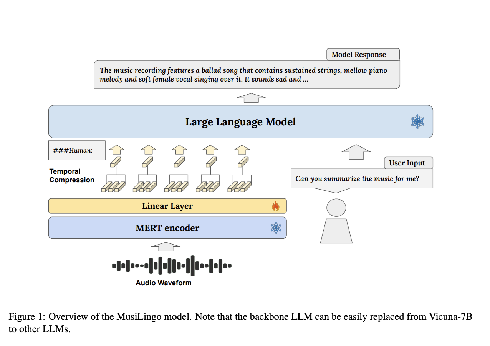
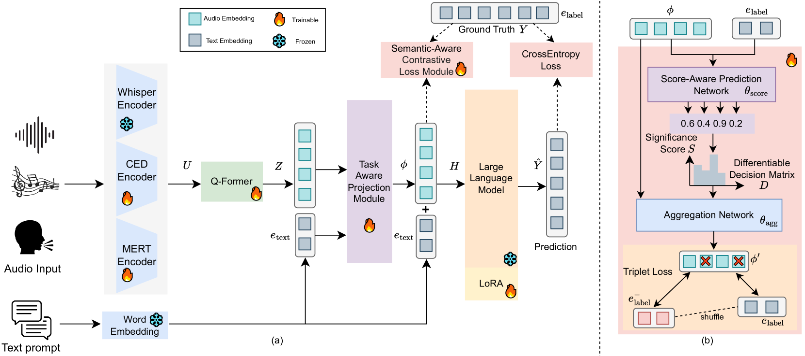

# text2preset

text2preset explores a text-to-audio-preset workflow so the team can generate effect chains from natural language. This README keeps the whole team aligned on project status, setup steps, and dataset references. Progress is tracked in issue [#17](https://github.com/vaclisinc/text2preset/issues/17)—check it before starting new work.

## Repository Structure

```text
text2preset/                         # project root
├── README.md                        # high-level status (you are here)
├── 1016-LLM-as-music-judge (1).pdf  # our latest proposal
├── baseline-system/                 # baseline pipeline implementation
│   ├── README.md                    # architecture sketch and legacy notes
│   ├── audio_samples/               # unprocessed audio currently scored by CLAP
│   ├── configs/                     # YAML configs (model choice, endpoints, chains)
│   ├── prompts/                     # system prompts for generation/judge/refine
│   ├── requirements.txt             # Python dependencies for the baseline
│   ├── src/                         # refine loop, LLM wrappers, scoring logic
│   └── tests/                       # pytest suites (refine loop, generation, etc.)
└── ref/                             # research datasets and documentation
    ├── fx-processor/                # cleaned dataset from Sony 2024 paper
    └── social-data/                 # raw SocialFX dataset + original paper
```

## Current Status

- Baseline refine loop is wired end-to-end: generate parameters → apply → score with CLAP → reprompt using the score.
- Plugin chain processing is still missing, so the judge scores the untouched files in `audio_samples/`. Wiring that step finishes the baseline milestone.
- Tests live in `baseline-system/tests/`; `test_refine_loop.py` is the quickest smoke test.


## Quick Start

1. Create a Python virtual environment (if you don’t already have one):
   ```bash
   python -m venv .venv
   source .venv/bin/activate
   ```
2. Install dependencies:
   ```bash
   cd baseline-system
   pip install -r requirements.txt
   ```
3. Run the refine-loop smoke test:
   ```bash
   pytest tests/test_refine_loop.py -s
   ```

## Configuration & Prompts

- `configs/default.yaml` controls the active model, API endpoint, and chain options. Feel free to add additional YAML configs and select them at runtime.
- `prompts/` holds the three system prompts (generation, judge, refine). If the loop behaves oddly, review these first.
- `src/` contains the core modules. Look at `tests/test_generation.py` and `tests/test_refine_loop.py` to understand the expected flow.

## Datasets

- `ref/social-data/` contains the raw SocialFX dataset. See `SocialFX_paper.pdf` inside for details.
- `ref/fx-processor/` provides the cleaned dataset from Sony’s 2024 paper *Can Large Language Models Predict Audio Effects Parameters from Natural Language?*

Neither dataset is wired into the baseline yet, but both are strong references for future expansion.

## Notes to discuss next week

### 1) Scoring with CLAP

CLAP is a retrieval model, not a generative model. It operates by:

1. Encoding the audio clip into an audio embedding.
2. Encoding a text description into a text embedding.
3. Measuring similarity between the embeddings to pick the closest description.

Because CLAP cannot produce new descriptions, the current MVP keeps a bank of 12 text embeddings and selects the closest match for scoring. This is a stopgap that will need improvement.

> Most CLIP/CLAP pipelines rely on a large, well-crafted bank of text embeddings, run a top-k retrieval, and then ask an LLM to rewrite the shortlisted descriptions. We can generate those banks with an LLM, but we must watch description quality.
>
> Another idea is to hand the CLAP audio embedding directly to an LLM, yet current models still struggle to interpret those embeddings.

### 2) Music DeepEncoder direction

Recent DeepSeek-OCR [Paper](ref/others/Deepseek-OCR/deepseek-ocr.pdf) work highlights a helpful pattern: compress PDF/image inputs into compact visual latents before touching the LLM, preserving fidelity while cutting tokens by roughly 10×. We can mimic that stack for audio so Charlotte’s MERT experiments slot in neatly.

- First-pass design lives in [`scoring-system/proposal.md`](scoring-system/proposal.md); it mirrors DeepSeek’s stages (local perception → global encoder → bridge → judge).

| Role                             | DeepSeek-OCR (vision) | MuDE (audio) suggestion | Rationale |
|----------------------------------|------------------------|-------------------------|-----------|
| Local perception / tokenizer     | SAM-base               | EnCodec                 | High-fidelity, locality-aware tokens that preserve timbre and micro-dynamics. |
| Global semantics / knowledge     | CLIP-large             | MERT                    | Music foundation model for deep structural understanding; outperforms CLAP on music tasks. |
| Bridge / compressor              | 16× conv compressor    | Q-Former + linear layers| Translate MERT features into compact latent packets with controllable length. |
| Decoder / judge                  | DeepSeek-3B-MoE        | Frozen LLM (e.g. Llama) | Reads compressed music latents to emit numeric scores or vibe vectors. |
- Related work to skim:
  1. **MusiLingo (2023)** – pushes audio through a MERT layer then a multimodal decoder. [Paper](ref/others/MusiLingo/MusiLingo.pdf)
    
     > Comparable to classic OCR without local chunking; suggests adding CLAP-style retrieval to capture timbre detail.
  2. **U-SAM (2025)** – unified speech/audio/music model. [Paper](ref/others/U-SAM/u-sam.pdf)
  
     > Strong generalist baseline, but does not emphasize latent compression.


## Two near-term explorations:

1. Assemble a larger, high-quality text-embedding bank (possibly LLM-generated) and use a DeepSeek-style top-k + rewrite loop.
2. Prototype audio latents: EnCodec for local tokens → MERT for global semantics → lightweight bridge into the judge LLM. If LLMs still can’t parse raw audio embeddings, expose the latents as structured tokens instead.
