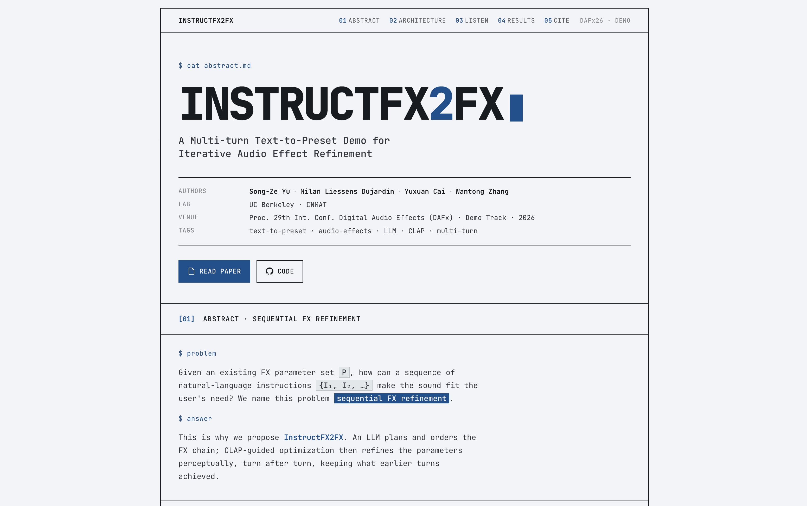

<div align="center">

# InstructFX2FX

### A Multi-Turn Text-to-Effect System for Sequential Audio Effect Refinement

<span style="white-space:nowrap;">Song-Ze Yu</span>&nbsp;·
<span style="white-space:nowrap;">Milan Liessens Dujardin</span>&nbsp;·
<span style="white-space:nowrap;">Yuxuan Cai</span>&nbsp;·
<span style="white-space:nowrap;">Wantong Zhang</span>&nbsp;·
<span style="white-space:nowrap;">Brian Cruz</span>&nbsp;·
<span style="white-space:nowrap;">Jeremy Wagner</span>&nbsp;·
<span style="white-space:nowrap;">Carmine-Emanuele Cella</span>

<sub>Center for New Music and Audio Technologies (CNMAT) · University of California, Berkeley</sub>

<br/>

[](https://arxiv.org/abs/2606.22005)
[](https://dafx26.mit.edu/)
[](https://instructfx2fx.vaclis.net/)
[](https://www.python.org/)

</div>

<p align="center">
  <a href="https://instructfx2fx.vaclis.net/">
    
  </a>
</p>

---

> **TL;DR.** Audio effect design is iterative, not one-shot. **InstructFX2FX** treats text-guided audio processing as **sequential FX refinement**: each new natural-language instruction updates an existing effect chain and parameter state while preserving what previous turns already achieved. An LLM acts as the planner and initializer; CLAP-guided optimization acts as the listener that refines parameters through gradient descent for differentiable effects and Bayesian optimization for non-differentiable Pedalboard effects.

## Highlights

| | |
|---|---|
| **Problem** | Stateful, multi-turn text-to-effect editing instead of independent text-to-preset generation |
| **Method** | LLM effect planning + LLM parameter initialization + CLAP-guided refinement over persistent session state |
| **Routing** | Initialize-only, reuse-only, or mixed reuse-and-initialize depending on what the session already contains |
| **Backends** | DASP gradient descent for EQ/reverb; Pedalboard Bayesian optimization for compressor, distortion, delay, pitch shift, and bitcrush |
| **Demo** | Human-in-the-loop auditioning with dry/result A/B and optimization checkpoint scrubbing |
| **Result** | Lower DSP-feature MMD than an LLM+LLM initialize-then-reprompt baseline on 9 of 10 SocialFX-derived descriptor pairs |

## Sequential FX Refinement

Single-shot text-to-effect systems map one prompt to one preset:

```text
P = g(x, I)
```

InstructFX2FX instead models audio effect editing as a stateful update:

```text
(C_t, P_t) = f(x, C_{t-1}, P_{t-1}, I_t, H_{t-1})
```

where `x` is the dry audio, `C_t` is the current effect chain, `P_t` is the current parameter state, `I_t` is the latest instruction, and `H_{t-1}` is the prior instruction history. Each turn should move the rendered audio toward the new target while keeping useful structure from earlier turns.

## Architecture

The 3-layer pipeline is orchestrated by [`src/pipeline/orchestrator.py`](src/pipeline/orchestrator.py):

```text
Instruction + dry audio + session state
        |
        v
+-------------------------------+
| Layer 1: FX Selector Agent    |  OpenRouter tool-calling LLM
| src/agents/fx_selector.py     |  -> ordered FX chain
+---------------+---------------+
                |
                v
+-------------------------------+
| Layer 2: Parser / Router      |  initialize, reuse, or mixed routing
| src/agents/parser.py          |  -> assembled params
+---------------+---------------+
                |
      +---------+---------+
      v                   v
+------------+      +----------------+
| Layer 3A   |      | Layer 3B       |
| DASP GD    | ---> | Pedalboard BO  |
| eq, rev    |audio | comp/dist/etc. |
+------------+      +----------------+
```

**Layer 1 - FX Selector Agent:** each supported effect is exposed as a callable tool. The LLM selects new effects in signal-chain order and avoids reselecting effects already present in the session.

**Layer 2 - Parser / Router:** the router compares the requested chain against the current session state:

| Mode | Session state | Action |
|------|---------------|--------|
| **Initialize-only** | none of the requested FX exist | LLM-initialize a fresh chain and render it once |
| **Reuse-only** | all requested FX already exist | refine existing parameters in place |
| **Mixed** | some requested FX exist, some are new | initialize missing effects, merge with existing params, then refine the chain |

**Layer 3 - CLAP-guided optimization:** DASP effects are optimized first, and their rendered audio feeds the Pedalboard stage. The optimization layer supports semantic similarity, directional, and guided semantic losses.

**Session state:** [`src/session/session.py`](src/session/session.py) stores the current parameters and prompt history so every turn is interpreted relative to the current sound.

## Available Effects

| Canonical name | Backend | Optimization | Notes |
|---------------|---------|--------------|-------|
| `eq` | DASP | Gradient descent | 6-band parametric EQ |
| `rev` | DASP | Gradient descent | Noise-shaped reverb |
| `comp` | Pedalboard | Bayesian optimization | Compressor |
| `dist` | Pedalboard | Bayesian optimization | Distortion |
| `delay` | Pedalboard | Bayesian optimization | Delay |
| `pitchshift` | Pedalboard | Bayesian optimization | Pitch shift |
| `bitcrush` | Pedalboard | Bayesian optimization | Bitcrusher |

## Evaluation Summary

The camera-ready paper reports a preliminary evaluation on SocialFX-derived EQ descriptors.

| Experiment | Setup | Result |
|------------|-------|--------|
| **Exp. 1: Sequential MMD** | 10 descriptor transitions such as `warm -> bright` and `harsh -> soft`; piano and violin audio; MMD over 35-dimensional DSP features | InstructFX2FX improves over the LLM+LLM initialize-then-reprompt baseline on 9 of 10 pairs |
| **Exp. 2: MMD trajectory** | Tracks MMD to the previous descriptor and the new target during gradient descent | In 9 of 10 descriptor pairs, optimization moves toward the new target without increasing MMD to the previous descriptor |
| **Exp. 3: LLM initialization ablation** | Starts from stochastic LLM initializations, then refines toward the same descriptor | DSP-feature MMD improves from 0.752 to 0.674; Fx-Encoder++ MMD improves from 0.752 to 0.643; 7 of 8 words improve |

The live demo includes trajectory plots and audio checkpoints so the user can hear gradual parameter movement, not just the final output.

## Installation

Use the repo-local virtual environment:

```bash
python -m venv .venv
source .venv/bin/activate
pip install -r requirements.txt
```

Create a `.env` file in the project root:

```env
OPENROUTER_API_KEY=your_api_key
```

CLAP weights are downloaded on first use.

## Quick Start

Run the multi-turn integration script on bundled dry audio:

```bash
source .venv/bin/activate
python tests/test_pipeline.py
```

The script drives realistic multi-turn sessions through the orchestrator and writes rendered audio plus parameter JSON to `tests/outputs/`.

The core Python API is one call per instruction, with `Session` carrying state across turns:

```python
from embeddings.clap import CLAPWrapper
from llms.llmclient import LLMClient
from pipeline.orchestrator import Orchestrator
from session.session import Session

llm = LLMClient()
clap = CLAPWrapper(device="cpu")
orch = Orchestrator(llm, clap, device="cpu")
session = Session(available_fx=["eq", "comp", "rev", "dist", "delay", "pitchshift", "bitcrush"])

result_1 = orch.run("bright", session, audio)
result_2 = orch.run("add warmth", session, audio)
```

See [`tests/test_pipeline.py`](tests/test_pipeline.py) for a complete runnable example with audio loading, model setup, output validation, and file export.

## Demo

**Live paper demo:** [`instructfx2fx.vaclis.net`](https://instructfx2fx.vaclis.net/) hosts the DAFx26 demo page with three gradient-descent sessions:

- `A fading dream`
- `From the chapel to the cosmos`
- `Underwater`

Each session supports dry/result A/B playback and checkpoint scrubbing across saved optimization snapshots. The static demo source lives in [`presentation/demo/`](presentation/demo/) and has no build step:

```bash
cd presentation/demo
python -m http.server
```

Then open `http://localhost:8000`.

**Interactive app prototype:** the repo also includes a React frontend and FastAPI backend for running sessions locally:

```bash
# backend
source .venv/bin/activate
uvicorn apps.web_api.app.main:app --reload

# frontend
cd apps/web_frontend
npm install
npm run dev
```

The API exposes sessions, audio uploads, run submission, run polling, FX metadata, and checkpoint selection.

## Project Structure

```text
src/
├── agents/
│   ├── fx_selector.py      # Layer 1: LLM FX selection via tool calls
│   └── parser.py           # Layer 2: session routing + optimization dispatch
├── configurations/
│   └── config.py           # Config dataclass and enums
├── effects/
│   └── fx.py               # Effect adapters, FXChainFactory, parameter ranges
├── embeddings/
│   └── clap.py             # CLAP audio/text embedding wrapper
├── FxSearcher/
│   └── fxsearcher.py       # Bayesian optimization for Pedalboard FX
├── llms/
│   └── llmclient.py        # OpenRouter client
├── metrics/                # DSP, CLAP, deep embedding, and MMD metrics
├── pipeline/
│   └── orchestrator.py     # Main entry point: Orchestrator.run()
├── prompts/
│   ├── prompt.py           # PromptFactory for DASP/Pedalboard initialization
│   └── instruction.py      # Instruction templates
├── runners/
│   └── runners.py          # Experiment/demo runners
├── session/
│   └── session.py          # Persistent session state
├── training/
│   ├── trainer.py          # move_in_CLAP()
│   ├── loss.py             # Semantic, directional, and guided losses
│   └── parameterengine.py  # Parameter normalization utilities
├── utilities/
│   ├── audio_processing.py
│   ├── fx_processing.py
│   └── text_processing.py
└── visualization/
    └── plotting.py

apps/
├── web_api/                # FastAPI local app backend
└── web_frontend/           # React/Vite local app frontend

presentation/demo/          # Static DAFx26 paper demo and assets
dry_audio/                  # Test audio files
tests/                      # End-to-end pipeline test script and outputs
```

Imports use bare module names such as `from pipeline.orchestrator import Orchestrator` because `src/` is added to `sys.path`.

## Citation

```bibtex
@misc{yu2026instructfx2fxmultiturntexttoeffectsequential,
      title={InstructFX2FX: A Multi-Turn Text-to-Effect System for Sequential Audio Effect Refinement}, 
      author={Song-Ze Yu and Milan Liessens Dujardin and Yuxuan Cai and Wantong Zhang and Brian Cruz and Jeremy Wagner and Carmine-Emanuele Cella},
      year={2026},
      eprint={2606.22005},
      archivePrefix={arXiv},
      primaryClass={cs.SD},
      url={https://arxiv.org/abs/2606.22005}, 
}
```

## Acknowledgements

InstructFX2FX builds on [LAION-CLAP](https://github.com/LAION-AI/CLAP) for audio-text embeddings, [`dasp`](https://github.com/csteinmetz1/dasp-pytorch) for differentiable audio effects, and [Pedalboard](https://github.com/spotify/pedalboard) for non-differentiable plugins. Its CLAP-guided objectives follow prior text-guided FX work including [Text2FX](https://arxiv.org/abs/2409.18847) and [FxSearcher](https://arxiv.org/abs/2511.14138), and its LLM initialization follows [LLM2Fx](https://arxiv.org/abs/2505.20770). Descriptor data is drawn from [SocialFX](https://dl.acm.org/doi/10.1145/2964284.2967207).
