# Baseline System - Text-to-Preset Audio Processing

## Experimental Architecture

```mermaid
graph TB
    AudioInput[Input audio sample]
    UserInput[Input:<br/>user input + system prompt]
    LLM[LLM]
    Output[Output:<br/>Parameters JSON format]
    System[System]
    ProcessedAudio[Processed audio]
    Judge[Judge System]
    Score[Score]
    RepromptInput[Input:<br/>System prompt + Score]

    AudioInput --> System
    UserInput --> LLM
    LLM --> Output
    Output --> System
    System --> ProcessedAudio
    ProcessedAudio --> Judge
    Judge --> Score
    Score --> RepromptInput
    RepromptInput --> LLM

    subgraph "High-level description"
        UserDesc[High-level description of a tone,<br/>e.g. system prompt after rain<br/>campus in October]
    end

    subgraph "Audio Effects Parameters"
        JSON["reverb: [<br/>delay_time: 0.0319,<br/>decay: 0.84,<br/>stereo_spread: -0.01,<br/>cutoff_freq: 16021,<br/>wet_gain: 2.018,<br/>wet_dry: 0.6],<br/>EQ: [......]"]
    end

    subgraph "Reprompt Logic"
        Reprompt[Reprompt by providing score<br/>e.g. The score is &#123;score&#125;, the user<br/>input is &#123;original input&#125;, your<br/>generated parameters: &#123;json&#125;,<br/>Please redesign the sound.]
    end

    UserDesc -.-> UserInput
    JSON -.-> Output
    Reprompt -.-> RepromptInput

    style Judge fill:#ffd966
    style ProcessedAudio fill:#6fa8dc
```

## System Overview

This baseline system implements a text-to-preset pipeline for audio effect parameter generation using LLMs. The architecture follows an iterative refinement loop:

1. **Input Phase**: User provides high-level descriptions (e.g., "after rain campus in October")
2. **Generation Phase**: LLM generates audio effect parameters in JSON format
3. **Processing Phase**: System applies parameters to input audio
4. **Evaluation Phase**: Judge system scores the processed audio
5. **Refinement Phase**: System reprompts LLM with score feedback for iterative improvement

## Key Components

- **LLM**: Generates audio effect parameters from textual descriptions
- **System**: Applies generated parameters to audio samples
- **Judge System**: Evaluates processed audio quality and alignment with user intent
- **Refinement Loop**: Iteratively improves parameters based on judge feedback

## Supported Audio Effects

- Reverb (delay_time, decay, stereo_spread, cutoff_freq, wet_gain, wet_dry)
- EQ (equalizer parameters)
- Compression
- Effect chains

## Getting Started

See [CLAUDE.md](../CLAUDE.md) for development workflow and TDD process.
See [.claude/plan/baseline-system.md](../.claude/plan/baseline-system.md) for implementation tasks.
